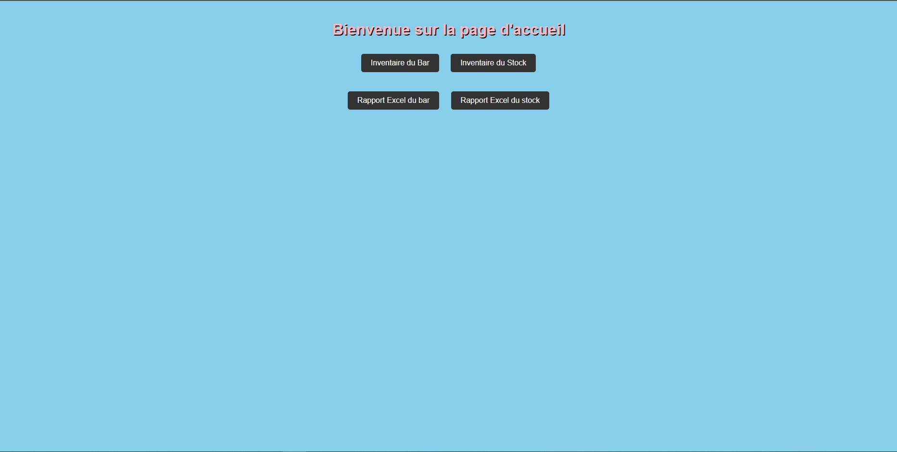
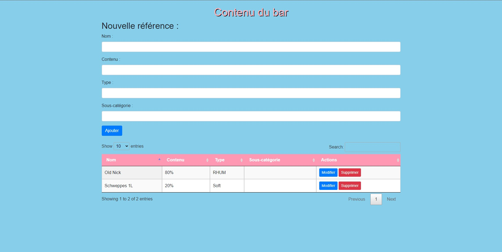
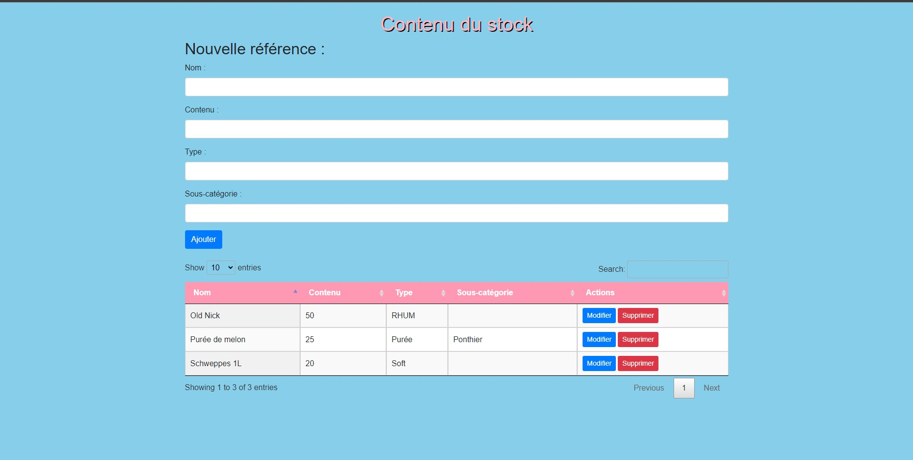
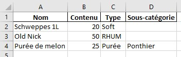

# API CRUD pour la gestion de stock

Ce projet est une API CRUD (Create, Read, Update, Delete) utilisée pour la gestion de stock. L'API permet de créer, lire, mettre à jour et supprimer des éléments liés au contenu du bar et au contenu du stock.

## Configuration requise

Avant d'utiliser l'API, assurez-vous d'avoir les éléments suivants installés :

- Python 3.7 ou une version ultérieure
- FastAPI
- SQLAlchemy
- pandas

## Description des fichiers

- `main.py`: Le fichier principal contenant la définition de l'API.
- `database.py`: Le fichier de configuration de la base de données.
- `crud.py`: Le fichier contenant les opérations CRUD (Create, Read, Update, Delete) sur la base de données.
- `models.py`: Le fichier contenant les modèles de données.
- `schemas.py`: Le fichier contenant les schémas de données pour la validation.
- `templates/`: Le répertoire contenant les templates Jinja2 pour l'affichage des pages HTML.
- `static/`: Le répertoire contenant les fichiers statiques tels que CSS, JS, images, etc.
- `Rapport/`: Le répertoire de destination pour les rapports générés sous forme de fichiers Excel.

## Endpoints de l'API

L'API comprend les endpoints suivants :

### Gestion des utilisateurs

- **GET /** : Affiche le formulaire de création d'utilisateur.
- **POST /users/** : Crée un nouvel utilisateur avec les informations fournies.

### Gestion du contenu du bar

- **GET /bar/** : Affiche le contenu du bar.
- **POST /bar/** : Crée un nouveau contenu de bar avec les informations fournies.
- **PUT /bar/{name}** : Met à jour une variable de contenu de bar spécifiée par son nom.
- **DELETE /bar/{name}** : Supprime une variable de contenu de bar spécifiée par son nom.
- **GET /bar/rapport_exel/** : Exporte les données du bar vers un fichier Excel.

### Gestion du contenu du stock

- **GET /stock/** : Affiche le contenu du stock.
- **POST /stock/** : Ajoute une nouvelle référence au stock avec les informations fournies.
- **PUT /stock/{name}** : Met à jour une variable du stock spécifiée par son nom.
- **DELETE /stock/{name}** : Supprime une variable du stock spécifiée par son nom.
- **GET /stock/rapport_exel/** : Exporte les données du stock vers un fichier Excel.

## Utilisation de l'API

Pour utiliser l'API, exécutez le fichier `main.py`. Une fois le serveur FastAPI en cours d'exécution, vous pouvez accéder aux différentes routes à l'aide d'un client HTTP (par exemple, votre navigateur ou des outils tels que cURL ou Postman).

Assurez-vous d'adapter les paramètres des requêtes en fonction des informations requises par chaque endpoint.

## Apercu de l' API

**Exemple d'utilisation :**

1. Accédez à la page d'accueil de l'API : `http://localhost:8000/`

2. Créez un nouvel utilisateur en utilisant le formulaire ou en effectuant une requête POST à `http://localhost:8000/users/` avec les informations requises.

3. Accédez aux différentes routes pour la gestion du contenu du bar et du stock en utilisant les liens `http://localhost:8000/stock` & `http://localhost:8000/bar`

Le Rapport generer resemble a sa :

